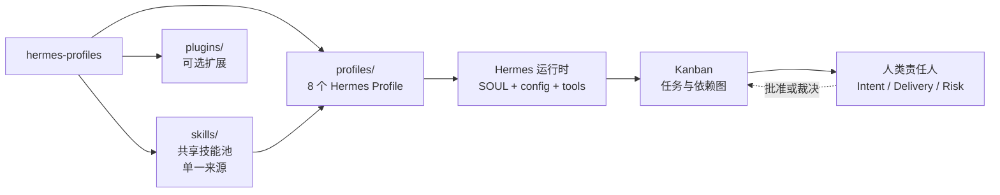
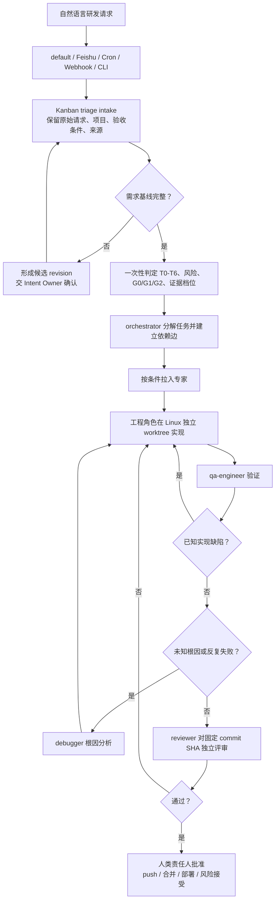
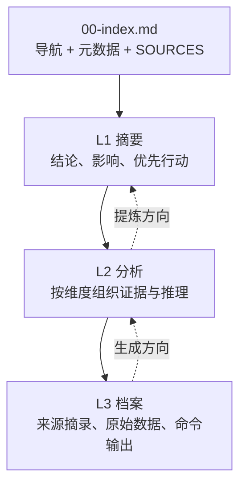

# Hermes Profiles：可带走的 R&D 协作说明

> 面向研发协作与平台工程师的速览文档。本文只描述本仓库当前可确认的结构与规则；标记为“规划”的内容不是已实现能力。

## 一句话定位

`hermes-profiles` 是一套面向 AI Native R&D 的 Hermes 角色配置集：用 Profile 隔离角色，用共享 Skill 注入方法论，用 Kanban 编排研发任务，用产物金字塔和结构化交接保存可追溯证据。

它是 **Hermes 的配置与方法论分发源**，不是独立的工作流引擎，也不替人类责任人决定业务价值、交付取舍或风险接受。

## 1. 项目全景



### 当前边界

| 部分 | 当前作用 | 不应误解为 |
|---|---|---|
| `skills/` | 方法论、参考资料和技能脚本的共享池 | Hermes Profile 本身 |
| `profiles/` | 角色身份、工具集、技能依赖和运行协议 | 通用 Agent 配置，可直接脱离 Hermes 运行 |
| `plugins/` | 可选的 Hermes 插件，例如 `rd-approval` | 主流程的必需依赖 |
| `default` | 部署侧的投递通道（Telegram/Feishu/Cron/Webhook/CLI → Kanban intake） | 本仓库中的一个 Profile 或研发决策角色 |
| `orchestrator` | 研发准入、任务分解、专家路由、证据综合 | 业务决策者或风险批准者 |

## 2. 仓库结构与角色

```text
hermes-profiles/
├── skills/                         # 共享方法论，真实文件
│   ├── artifact-pyramids/
│   ├── orchestration-methodology/
│   ├── backend-engineering/
│   ├── frontend-engineering/
│   ├── qa-methodology/
│   ├── research-methodology/
│   └── ...
├── profiles/                       # 角色配置，技能为物化真实副本（可独立安装）
│   ├── orchestrator/
│   ├── researcher/
│   ├── technical-architect/
│   ├── backend-engineer/
│   ├── frontend-engineer/
│   ├── qa-engineer/
│   ├── debugger/
│   └── reviewer/
├── plugins/rd-approval/             # 可选审批命令插件
└── scripts/                         # sync_skills / validate / publish / install-all
```

每个 Profile 的关键文件：

| 文件 | 作用 |
|---|---|
| `SOUL.md` | 权威运行协议：第一原则、边界、触发模式、输出契约 |
| `config.yaml` | 模型、provider 和工具集；`orchestrator` 额外启用 `kanban` |
| `profile.yaml` | 元数据和必需/推荐技能声明（sync_skills.py 据此物化副本） |
| `distribution.yaml` | distribution manifest：`name`（与目录名一致）、`version`、`env_requires`（安装器据此生成 `.env.EXAMPLE` 并预检） |
| `README.md` | 面向人的安装和使用说明 |
| `AGENTS.md` | 指向 `SOUL.md` 的索引及上下游接口 |
| `skills/` | 从根级共享技能池物化的真实文件副本（sync_skills.py 生成） |

### 角色职责

| 角色 | 何时进入 | 主要职责 | 典型输出 | 直接面向用户 |
|---|---|---|---|---|
| `orchestrator` | 所有研发请求 | 准入、分解、路由、监控、综合 | Flow、任务图、交接与决策包 | 是，作为唯一研发入口 |
| `researcher` | 外部事实或证据不足 | 调查、三角验证、来源追溯 | 研究金字塔 | 否 |
| `technical-architect` | 契约、数据模型、部署或质量属性受影响 | 架构分析、C4、ADR、约束提取 | 架构金字塔 | 否 |
| `backend-engineer` | 后端实现切片 | API、服务逻辑、数据库和集成 | 实现变更与证据 | 否 |
| `frontend-engineer` | 前端实现切片 | UI、状态、API 集成和性能 | 实现变更与证据 | 否 |
| `qa-engineer` | 实现前后 | 验证策略、自动化、回归和质量门 | 测试策略、测试结果 | 否 |
| `debugger` | 根因未知或反复失败 | 复现、隔离、根因分析 | 调试分析与修复建议 | 否 |
| `reviewer` | G1/G2 或明确要求独立评审 | 基线符合性、工程质量、证据核验 | 评审结论与风险 | 否 |

## 3. 研发请求如何流转



### 门禁和证据由 intake 决定

| 任务范围 | 门禁 | Reviewer 拓扑 | 典型参与者 |
|---|---|---|---|
| T0/T1：答问、讨论、研究 | G0 | 不创建 reviewer | `orchestrator` |
| T2 | G1 | reviewer 可选轻量检查，不作为下游父卡 | 专家（+ QA 视范围） |
| 普通 T3 / T4 | G1 + QA | reviewer 轻量；QA 必须执行验证 | 专家 + QA |
| T5/T6、影响生产的 T3、信息不足或高风险 | G2 | 同步 reviewer + 完整质量门 | 专家 + QA + reviewer + Risk Approver |

G1 交接必须含 `review_status: pending`；发现缺陷时标记综合产物 `superseded` 并回到实现 / QA。

下游不能自行降低门禁或证据档位。若证据不足，应阻断、补证，或明确标记 `confidence: reduced` 与 `uncovered`。

### 工作区路由

- 讨论、研究、规划和只读核对：`scratch`
- 非代码串行资产：受控 `dir`
- 同一 Flow 的低风险串行代码：可复用同一 Flow worktree
- 并行重叠、独立分支、破坏性实验或失败隔离：per-task worktree
- 代码任务不使用共享可变 `dir`；缺少 workspace 锚点时不得建卡

## 4. 结构化交接与产物金字塔

交接消息负责“能否继续、由谁处理、证据在哪里”；金字塔负责保存详细交付物。两者不能互相替代。

```yaml
status: completed | blocked | review_required | needs_decision
summary: 一到三句话说明结果和当前状态
artifact: /absolute/path/00-index.md
evidence:
  tasks: [t_xxx]
  commit: <完整 SHA>
  baseline: <revision 或 SHA>
  changed_files: [path + blob_sha]
  commands: [command + exit_code + stdout_sha256]
  evidence_level: L0 | L1 | L1+L2 | Full
  seb_integrity: passed | failed | not_required
risks: [未验证假设和残余风险]
decisions_required: [需要哪位人类责任人裁决什么]
```

### 4.1 产物金字塔：按阅读深度组织



- `00-index.md` 只回答“去哪里找”，不放发现、结论或评分。
- L1 回答“我应该做什么”；L2 回答“为什么”；L3 回答“如何证明”。
- 每个文件都要有 `SOURCES`，并说明继续深入会看到什么。
- 只创建需要的层，不为 L0 或不需要的深度创建空目录。

### 4.2 证据档位：决定生成到哪一层


| 档位 | 适用场景 | 最低产物 |
|---|---|---|
| `L0` | T0/T1、纯状态/阻断/澄清、单文件小改动 | 结构化交接，不建金字塔 |
| `L1` | 多文件或单模块改动 | `00-index.md` + `01-summary/` |
| `L1+L2` | 跨模块、新依赖、接口/契约变化 | 增加 `02-analysis/` |
| `Full` | 迁移、公开 API、安全、高风险 T5/T6 | 三层齐备、SEB 和门禁产物 |

**不要混淆：**金字塔层级叫 L1/L2/L3；证据档位叫 L0/L1/L1+L2/Full。前者描述内容深度，后者描述本次任务需要生成到哪里。

## 5. 嵌入 Hermes

### 5.1 安装示例（Linux/macOS/Windows 通用）

安装 8 个角色中任意一个（每个角色是独立的 distribution 仓库；完整清单见根 README 的「使用角色配置」）：

```bash
# 1. 安装角色
hermes profile install github.com/lovelybowen/orchestrator-agent --alias

# 2. 配置模型凭据（安装器已生成 .env.EXAMPLE；真实 .env 不会进入 Git）
cp ~/.hermes/profiles/orchestrator/.env.EXAMPLE ~/.hermes/profiles/orchestrator/.env
# 编辑 .env，填写 DEEPSEEK_API_KEY

# 3. 检查 Hermes 实际加载的技能
hermes -p orchestrator skills list

# 4. 启动
hermes --profile orchestrator

# 5. 跟进新版本（memories / sessions / 本地 config.yaml 保留）
hermes profile update orchestrator
```

Windows 上 profile 路径为 `%~/.hermes%\profiles\<role>`（即 `D:\hermes\profiles\<role>` 之类，取决于安装位置），`.env` 配置方式相同。不同 Hermes 版本可能使用 `hermes -p <name>` 或 `hermes --profile <name>`；以本地 CLI 的帮助信息为准。

### 5.2 可选启用审批插件

`rd-approval` 不是核心编排依赖，已随 orchestrator 的 distribution 一并安装到 `~/.hermes/profiles/orchestrator/plugins/rd-approval`。若部署侧启用 Hermes 插件目录，可将其复制到活动的 `$HERMES_HOME/plugins`：

```bash
mkdir -p "${HERMES_HOME:-$HOME/.hermes}/plugins"
cp -r ~/.hermes/profiles/orchestrator/plugins/rd-approval \
  "${HERMES_HOME:-$HOME/.hermes}/plugins/rd-approval"
```

插件提供 `/decision show|approve|reject ...`，只记录绑定决策并解锁 Kanban 任务，不直接执行 push、merge 或 deploy。

### 5.3 当前嵌入限制

> **当前实现**

- Profile 依赖 Hermes 对 `SOUL.md`、`config.yaml`、`profile.yaml` 和 `skills/` 的加载约定。
- 每个角色发布为独立 distribution 仓库（`scripts/publish.sh` 从本 monorepo 生成）；仓库根 `skills/` 是共享池的单一来源，各角色 `skills/` 下为物化真实副本。
- 禁止符号链接：`hermes profile install` 硬性拒绝 symlink payload，Windows 克隆（`core.symlinks=false`）会把 symlink 退化为文本文件。
- 每个 Profile 的 `.no-bundled-skills` 随 distribution 安装，避免 Hermes 首次运行时播种整套自带技能。
- 修改共享池后运行 `python3 scripts/sync_skills.py` 重新物化；出现 `.hub` 等运行时状态时，先运行 `scripts/clean_profile_runtime.sh`，再运行校验脚本。

## 6. 如何带到其他 Agent 环境

| 迁移对象 | 可直接迁移性 | 适配工作 |
|---|---|---|
| `skills/*/SKILL.md` 和 `references/` | 高 | 映射目标 Agent 的技能加载命令 |
| `SOUL.md` 角色协议 | 中 | 映射身份注入、上下文和工具权限 |
| `profile.yaml` / `config.yaml` | 低 | 重写为目标运行时的模型、工具和元数据配置 |
| Kanban 编排规则 | 中 | 目标系统需支持任务、依赖边、状态和 worktree |
| `rd-approval` 插件 | 低 | 需要 Hermes 插件注册和决策桥接接口 |

推荐迁移顺序：

```text
先迁移技能
  → 再迁移角色协议
  → 映射工具与任务系统
  → 保留结构化交接
  → 最后接入审批与运行治理
```

最重要的可迁移接口不是某个 CLI，而是三项约定：

1. 输入有稳定的需求基线和 revision。
2. 专家通过结构化消息交接，而不是只返回一段散文。
3. 详细产物有稳定路径、来源导航和可复核证据。

## 7. 后续优化路线图

以下均为规划方向，当前仓库不应把它们描述为已经由 Hermes 平台自动完成。

本仓库的目标不是服务单一项目，而是沉淀通用的技能与角色协议，支撑多个项目的长期研发。围绕这个目标，路线图在三个时间尺度上展开；其中「项目接入约定」「技能回流」「版本兼容矩阵」三项直接服务于多项目通用化。

### 短期：项目接入约定与安装摩擦

- ~~提供跨平台安装脚本~~ 已完成：`hermes profile install` + `scripts/install-all.sh`。
- **项目上下文绑定（AGENTS.md 约定）**：角色 Profile 保持项目无关；项目差异统一落在各项目仓库根目录的 `AGENTS.md` 中声明——构建 / 测试 / lint 命令、worktree 与分支约定、部署边界、Intent / Delivery / Risk 责任人映射。orchestrator 建卡时 `workspace_path` 指向该项目的 worktree，Hermes 按工作目录自动发现并注入该 `AGENTS.md`。验收标准：新项目接入只需「项目仓库写 AGENTS.md + 为项目建独立 Kanban board（`hermes kanban boards`）」，不改动任何 Profile。
- **版本兼容矩阵**：维护 Profile 版本 × Hermes 版本的最小兼容矩阵；每个 distribution 的 README 登记已验证的 Hermes 版本（当前基线 v0.21.x）。SOUL 与文档中引用的平台能力（`kanban.orchestrator_profile`、Kanban 卡片 `--goal`、PR completion contract）需声明最低 Hermes 版本；升级 Hermes 后按矩阵判断哪些角色需要跟进更新。
- 增加跨平台的路径与权限检查（Windows 路径、行尾、大小写不敏感文件系统）。
- 启动前检查技能数量、`.no-bundled-skills` 和运行时污染。

### 中期：技能回流闭环与证据机器校验

- **技能回流协议**：当前技能流向是单向的（`skills/` 池 → 物化副本 → distribution 分发）。补齐反向闭环：角色在任务执行中产生的技能改进（Hermes 支持 agent 创建 / 修改技能），以「改进建议 + 触发场景 + 涉及技能」的形式归集到 Kanban 任务或定期评审；由人审查后 PR 进本仓库共享池，运行 `sync_skills.py` 物化并 bump distribution 版本，各端 `hermes profile update` 跟进。验收标准：完整跑通一次「项目中发现方法论缺陷 → 池内改进 → 全团队角色更新」的回路，本仓库从分发源升级为团队方法论中枢。
- 固化结构化交接 Schema，并对字段做静态校验。
- 自动生成 `changed_files`、blob hash、命令 exit code 和 stdout hash。
- 自动核验 SEB 完整性，发现 SHA、baseline 或产物 hash 漂移时停止复用。
- 为产物金字塔增加索引审计、孤立主张检查和质量门报告。

### 长期：补齐编排平台能力

- workspace routing 的声明式配置与实际运行时执行。
- 运行中 worker 的取消、中断和 draining。
- 自动超时降级、声明式可选/条件门禁和事件 roll-up。
- 按 `observe → shadow → gray rollout → expand → default` 推进治理规则迁移。

## 8. 验证清单

```bash
# 配置、YAML、manifest、技能副本一致性
python3 scripts/validate_profiles.py

# 检查 Markdown 和补丁中的空白错误
git diff --check
```

交付前还应确认：

- Mermaid 代码块全部闭合，节点 ID 和连线一致。
- 文档中的仓库相对路径真实存在。
- README 入口能定位到本文档。
- 没有引入 Playwright、浏览器自动化或新的构建依赖。
- Git diff 只包含本文档和 README 入口变更。

## 进一步阅读

- [根 README](../README.md)
- [贡献指南](../CONTRIBUTING.md)
- [仓库 Agent 指南](../AGENTS.md)
- [编排方法论](../skills/orchestration-methodology/SKILL.md)
- [产物金字塔技能](../skills/artifact-pyramids/SKILL.md)
- [Profile 校验脚本](../scripts/validate_profiles.py)
