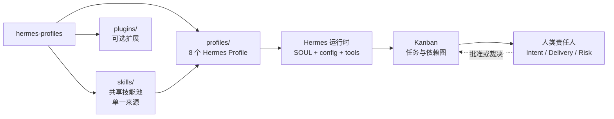
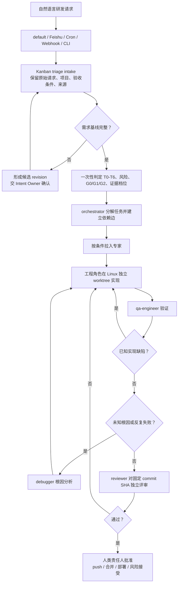
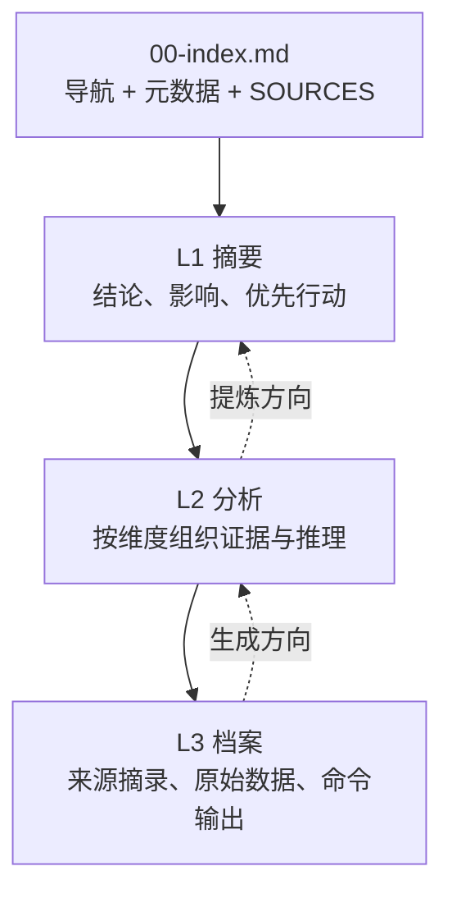

# Hermes Profiles：可带走的 R&D 协作说明

> 面向研发协作与平台工程师的速览文档。本文只描述本仓库当前可确认的结构与规则；标记为“规划”的内容不是已实现能力。

## 一句话定位

`hermes-profiles` 是一套面向 AI Native R&D 的 Hermes 角色配置集：用 Profile 隔离角色，用共享 Skill 注入方法论，用 Kanban 编排研发任务，用产物金字塔和结构化交接保存可追溯证据。

它是 **Hermes 的配置与方法论分发源**，不是独立的工作流引擎，也不替人类责任人决定业务价值、交付取舍或风险接受。

## 1. 项目全景



### 当前边界

| 部分 | 当前作用 | 不应误解为 |
|---|---|---|
| `skills/` | 方法论、参考资料和技能脚本的共享池 | Hermes Profile 本身 |
| `profiles/` | 角色身份、工具集、技能依赖和运行协议 | 通用 Agent 配置，可直接脱离 Hermes 运行 |
| `plugins/` | 可选的 Hermes 插件，例如 `rd-approval` | 主流程的必需依赖 |
| `default` | 部署侧的 Feishu/Cron/Webhook/CLI ingress | 本仓库中的一个 Profile |
| `orchestrator` | 研发准入、任务分解、专家路由、证据综合 | 业务决策者或风险批准者 |

## 2. 仓库结构与角色

```text
hermes-profiles/
├── skills/                         # 共享方法论，真实文件
│   ├── artifact-pyramids/
│   ├── orchestration-methodology/
│   ├── backend-engineering/
│   ├── frontend-engineering/
│   ├── qa-methodology/
│   ├── research-methodology/
│   └── ...
├── profiles/                       # 角色配置，技能通过相对符号链接引用
│   ├── orchestrator/
│   ├── researcher/
│   ├── technical-architect/
│   ├── backend-engineer/
│   ├── frontend-engineer/
│   ├── qa-engineer/
│   ├── debugger/
│   └── reviewer/
├── plugins/rd-approval/             # 可选审批命令插件
└── scripts/                         # 配置校验与运行时清理
```

每个 Profile 的关键文件：

| 文件 | 作用 |
|---|---|
| `SOUL.md` | 权威运行协议：第一原则、边界、触发模式、输出契约 |
| `config.yaml` | 模型、provider 和工具集；`orchestrator` 额外启用 `kanban` |
| `profile.yaml` | 元数据和必需/推荐技能声明 |
| `README.md` | 面向人的安装和使用说明 |
| `AGENTS.md` | 指向 `SOUL.md` 的索引及上下游接口 |
| `skills/` | 指向根级共享技能池的相对符号链接 |

### 角色职责

| 角色 | 何时进入 | 主要职责 | 典型输出 | 直接面向用户 |
|---|---|---|---|---|
| `orchestrator` | 所有研发请求 | 准入、分解、路由、监控、综合 | Flow、任务图、交接与决策包 | 是，作为唯一研发入口 |
| `researcher` | 外部事实或证据不足 | 调查、三角验证、来源追溯 | 研究金字塔 | 否 |
| `technical-architect` | 契约、数据模型、部署或质量属性受影响 | 架构分析、C4、ADR、约束提取 | 架构金字塔 | 否 |
| `backend-engineer` | 后端实现切片 | API、服务逻辑、数据库和集成 | 实现变更与证据 | 否 |
| `frontend-engineer` | 前端实现切片 | UI、状态、API 集成和性能 | 实现变更与证据 | 否 |
| `qa-engineer` | 实现前后 | 验证策略、自动化、回归和质量门 | 测试策略、测试结果 | 否 |
| `debugger` | 根因未知或反复失败 | 复现、隔离、根因分析 | 调试分析与修复建议 | 否 |
| `reviewer` | G1/G2 或明确要求独立评审 | 基线符合性、工程质量、证据核验 | 评审结论与风险 | 否 |

## 3. 研发请求如何流转



### 门禁和证据由 intake 决定

| 任务范围 | 门禁 | 典型参与者 |
|---|---|---|
| T0/T1：答问、讨论、研究 | G0，不创建 reviewer | `orchestrator` |
| T2、非生产 T3、T4 | G1，QA 必须执行时另加 QA 门；reviewer 轻量异步 | 专家 + QA + 可选 reviewer |
| T5/T6、影响生产的 T3、信息不足 | G2，同步 reviewer，阻断式质量门 | 专家 + QA + reviewer + Risk Approver |

下游不能自行降低门禁或证据档位。若证据不足，应阻断、补证，或明确标记 `confidence: reduced` 与 `uncovered`。

### 工作区路由

- 讨论、研究、规划和只读核对：`scratch`
- 非代码串行资产：受控 `dir`
- 同一 Flow 的低风险串行代码：可复用同一 Flow worktree
- 并行重叠、独立分支、破坏性实验或失败隔离：per-task worktree
- 代码任务不使用共享可变 `dir`；缺少 workspace 锚点时不得建卡

## 4. 结构化交接与产物金字塔

交接消息负责“能否继续、由谁处理、证据在哪里”；金字塔负责保存详细交付物。两者不能互相替代。

```yaml
status: completed | blocked | review_required | needs_decision
summary: 一到三句话说明结果和当前状态
artifact: /absolute/path/00-index.md
evidence:
  tasks: [t_xxx]
  commit: <完整 SHA>
  baseline: <revision 或 SHA>
  changed_files: [path + blob_sha]
  commands: [command + exit_code + stdout_sha256]
  evidence_level: L0 | L1 | L1+L2 | Full
  seb_integrity: passed | failed | not_required
risks: [未验证假设和残余风险]
decisions_required: [需要哪位人类责任人裁决什么]
```

### 4.1 产物金字塔：按阅读深度组织



- `00-index.md` 只回答“去哪里找”，不放发现、结论或评分。
- L1 回答“我应该做什么”；L2 回答“为什么”；L3 回答“如何证明”。
- 每个文件都要有 `SOURCES`，并说明继续深入会看到什么。
- 只创建需要的层，不为 L0 或不需要的深度创建空目录。

### 4.2 证据档位：决定生成到哪一层


| 档位 | 适用场景 | 最低产物 |
|---|---|---|
| `L0` | T0/T1、纯状态/阻断/澄清、单文件小改动 | 结构化交接，不建金字塔 |
| `L1` | 多文件或单模块改动 | `00-index.md` + `01-summary/` |
| `L1+L2` | 跨模块、新依赖、接口/契约变化 | 增加 `02-analysis/` |
| `Full` | 迁移、公开 API、安全、高风险 T5/T6 | 三层齐备、SEB 和门禁产物 |

**不要混淆：**金字塔层级叫 L1/L2/L3；证据档位叫 L0/L1/L1+L2/Full。前者描述内容深度，后者描述本次任务需要生成到哪里。

## 5. 嵌入 Hermes

### 5.1 Linux/macOS 示例

```bash
# 1. 获取分发源
git clone https://github.com/lovelybowen/hermes-profiles.git ~/hermes-profiles

# 2. 选择一个 Profile；研发编排通常从 orchestrator 开始
mkdir -p "${HERMES_HOME:-$HOME/.hermes}/profiles"
ln -s ~/hermes-profiles/profiles/orchestrator \
  "${HERMES_HOME:-$HOME/.hermes}/profiles/orchestrator"

# 3. 配置模型凭据（真实 .env 不会进入 Git）
cp ~/hermes-profiles/profiles/orchestrator/.env.example \
  ~/hermes-profiles/profiles/orchestrator/.env
# 编辑 .env，填写 DEEPSEEK_API_KEY

# 4. 在仓库根目录校验结构和技能链接
cd ~/hermes-profiles
python3 scripts/validate_profiles.py

# 5. 检查 Hermes 实际加载的技能
hermes -p orchestrator skills list

# 6. 启动
hermes --profile orchestrator
```

不同 Hermes 版本可能使用 `hermes -p <name>` 或 `hermes --profile <name>`；以本地 CLI 的帮助信息为准。

### 5.2 可选启用审批插件

`plugins/rd-approval` 不是核心编排依赖。若部署侧启用 Hermes 插件目录，可将其链接到活动的 `$HERMES_HOME/plugins`：

```bash
mkdir -p "${HERMES_HOME:-$HOME/.hermes}/plugins"
ln -s ~/hermes-profiles/plugins/rd-approval \
  "${HERMES_HOME:-$HOME/.hermes}/plugins/rd-approval"
```

插件提供 `/decision show|approve|reject ...`，只记录绑定决策并解锁 Kanban 任务，不直接执行 push、merge 或 deploy。

### 5.3 当前嵌入限制

> **当前实现**

- Profile 依赖 Hermes 对 `SOUL.md`、`config.yaml`、`profile.yaml` 和 `skills/` 的加载约定。
- Profile 的技能目录是指向仓库根 `skills/` 的相对符号链接，Git 中应保持 `120000` 模式。
- 每个 Profile 的 `.no-bundled-skills` 应保留，避免 Hermes 首次运行时播种整套自带技能。
- Hermes 使用 `rglob("SKILL.md")` 判断技能安装状态，而 Python `rglob` 不跟随目录符号链接；这可能导致误判并写入运行时目录。
- 出现真实技能目录、`.hub` 或其他运行时状态时，先运行 `scripts/clean_profile_runtime.sh`，再运行校验脚本。

## 6. 如何带到其他 Agent 环境

| 迁移对象 | 可直接迁移性 | 适配工作 |
|---|---|---|
| `skills/*/SKILL.md` 和 `references/` | 高 | 映射目标 Agent 的技能加载命令 |
| `SOUL.md` 角色协议 | 中 | 映射身份注入、上下文和工具权限 |
| `profile.yaml` / `config.yaml` | 低 | 重写为目标运行时的模型、工具和元数据配置 |
| Kanban 编排规则 | 中 | 目标系统需支持任务、依赖边、状态和 worktree |
| `rd-approval` 插件 | 低 | 需要 Hermes 插件注册和决策桥接接口 |

推荐迁移顺序：

```text
先迁移技能
  → 再迁移角色协议
  → 映射工具与任务系统
  → 保留结构化交接
  → 最后接入审批与运行治理
```

最重要的可迁移接口不是某个 CLI，而是三项约定：

1. 输入有稳定的需求基线和 revision。
2. 专家通过结构化消息交接，而不是只返回一段散文。
3. 详细产物有稳定路径、来源导航和可复核证据。

## 7. 后续优化路线图

以下均为规划方向，当前仓库不应把它们描述为已经由 Hermes 平台自动完成。

### 短期：降低安装和运行摩擦

- 提供跨平台安装脚本，自动创建 Profile、插件和技能链接。
- 增加 Windows/macOS/Linux 的链接、权限和路径检查。
- 为 Profile 和共享技能增加版本登记与兼容矩阵。
- 启动前检查技能数量、`.no-bundled-skills` 和运行时污染。

### 中期：让证据可机器校验

- 固化结构化交接 Schema，并对字段做静态校验。
- 自动生成 `changed_files`、blob hash、命令 exit code 和 stdout hash。
- 自动核验 SEB 完整性，发现 SHA、baseline 或产物 hash 漂移时停止复用。
- 为产物金字塔增加索引审计、孤立主张检查和质量门报告。

### 长期：补齐编排平台能力

- workspace routing 的声明式配置与实际运行时执行。
- 运行中 worker 的取消、中断和 draining。
- 自动超时降级、声明式可选/条件门禁和事件 roll-up。
- 按 `observe → shadow → gray rollout → expand → default` 推进治理规则迁移。

## 8. 验证清单

```bash
# 配置、YAML、技能前置关系和相对符号链接
python3 scripts/validate_profiles.py

# 检查 Markdown 和补丁中的空白错误
git diff --check
```

交付前还应确认：

- Mermaid 代码块全部闭合，节点 ID 和连线一致。
- 文档中的仓库相对路径真实存在。
- README 入口能定位到本文档。
- 没有引入 Playwright、浏览器自动化或新的构建依赖。
- Git diff 只包含本文档和 README 入口变更。

## 进一步阅读

- [根 README](../README.md)
- [贡献指南](../CONTRIBUTING.md)
- [仓库 Agent 指南](../AGENTS.md)
- [编排方法论](../skills/orchestration-methodology/SKILL.md)
- [产物金字塔技能](../skills/artifact-pyramids/SKILL.md)
- [Profile 校验脚本](../scripts/validate_profiles.py)
