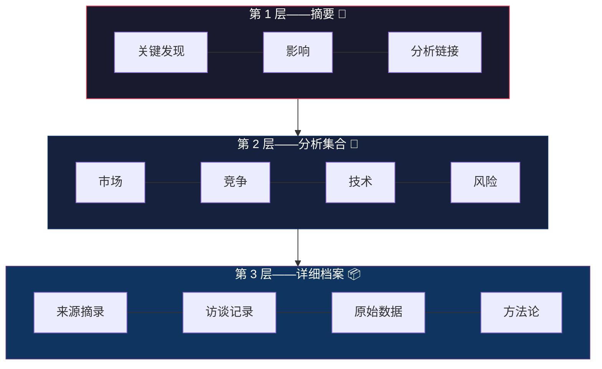

# 产物金字塔

**对 AI Agent 的产出实施渐进披露——摘要 → 分析集合 → 档案。**

产物金字塔是一种结构化方法论，用于将 AI Agent 的研究输出组织成深度递增的三个层级。正如渐进披露约束我们如何向 Agent 提供上下文，产物金字塔约束它们如何产出内容——使下游 Agent 和人类能够按所需深度使用这些内容。

| 层级 | 包含内容 | 使用者 |
|-------|-----------------|-----------------|
| **L1：摘要** | 研究问题、关键发现、影响（一份文件） | PM Agent、高管、快速浏览者 |
| **L2：分析集合** | 按维度拆分的文件（市场、竞争、技术、风险） | 分析师、领域专用 Agent |
| **L3：详细档案** | 来源摘录、访谈记录、原始数据、方法论 | 验证者、深度研究人员 |



## 为什么？

当前 AI Agent 工作流在**输入侧**采用渐进披露（元数据 → 指令 → 资源），却在**输出侧**生成扁平、单体式的输出。产物金字塔修复了这种不对称，使 Agent 输出：

- 在每个保真度层级都可**独立使用**
- 从已发布主张到来源可**双向追溯**
- **适合流水线处理**，可用于多 Agent 研究工作流
- 每个转换步骤都有**质量门**

## 快速开始

```bash
# 检查研究项目的金字塔健康状况
scripts/pyramid-status.sh ./my-project

# 从来源文件中提取候选原子主张
scripts/extract-atoms.py source.txt --source-id paper-001 --domain scaling-laws

# 为新研究项目创建脚手架
cp assets/pyramid-template.md ./my-project/00-index.md
```

## 仓库结构

```
artifact-pyramids/
├── SKILL.md                    # 符合 Agent Skills 规范的技能（可由 AI Agent 加载）
├── README.md                   # 本文件
├── LICENSE                     # MIT
├── scripts/
│   ├── pyramid-status.sh       # 审计项目目录的结构覆盖情况
│   └── extract-atoms.py        # 从来源文本提取原子主张
├── references/
│   ├── artifact-pyramid-framework.md   # 完整概念基础
│   ├── pipeline-stages.md              # 详细层级定义和导航格式
│   ├── quality-gates.md                # 各层级的验证准则
│   └── synthetic-example.md            # 完整演练示例（合成数据）
└── assets/
    ├── pyramid-template.md             # 项目脚手架模板
    └── artifact-inventory.md           # 跨层跟踪模板
```

## 面向 AI Agent

本仓库以符合 [Agent Skills](https://agentskills.io) 规范的技能形式发布。要在 Hermes Agent 中加载它：

```bash
git clone https://github.com/groktopus/artifact-pyramids ~/.hermes/skills/artifact-pyramids
```

随后，任何已加载该技能的会话都可调用 `skill_view(name='artifact-pyramids')` 将其激活。

## 三个层级

| 层级 | 内容 | 使用者 | 生成者 |
|-------|----------|-------------|--------------|
| **L1：摘要** | 一份文件——研究问题、关键发现、影响。链接到 L2 分析文件。 | PM Agent、高管、快速浏览者 | Researcher 从 L2 综合生成 |
| **L2：分析集合** | 按维度拆分的文件——市场、竞争、技术、风险。可独立使用，并链接到 L3 | 领域专家、分析类 Agent | 分析人员从 L3 档案中提取 |
| **L3：详细档案** | 来源摘录、原始数据表、访谈记录、方法论说明 | 验证者、深度研究 Agent | 收集人员从一手来源中采集 |

## 许可证

MIT
