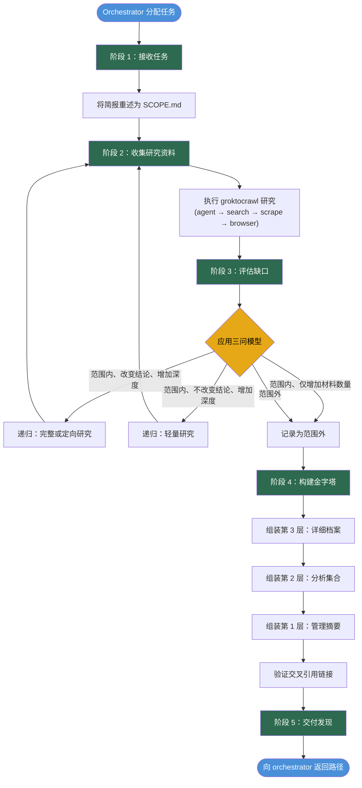

# 研究员工作流 - 决策图

## 流程说明

- 阶段 1、2、4、5 必须执行且顺序固定。
- 阶段 3 是唯一分支点，可以返回阶段 2 进行递归调查。
- 递归强度从轻量（仅搜索）到完整研究（运行 Agent）不等。
- 最多递归两轮，之后必须升级处理。
- 产物累积在 `<artifacts-root>/<mission-slug>/`。
- 金字塔自底向上构建：档案 → 分析 → 摘要。
