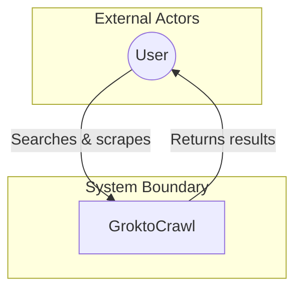
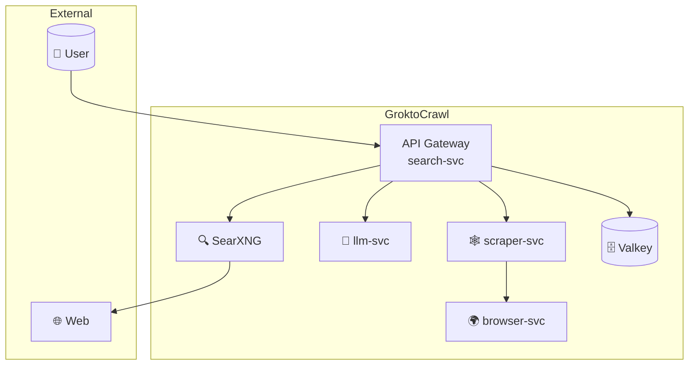
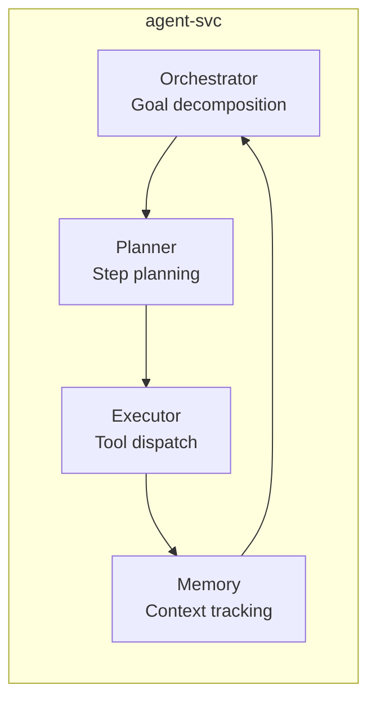

# 使用 Mermaid 绘制 C4 模型

Mermaid 尚未具备稳定的原生 C4 语法。`C4Context` 和 `C4Container` 属于实验性且不可靠的能力。正式 C4 图应使用 **Structurizr DSL**；需要内联 Markdown 而无法使用 Structurizr 时，采用下方流程图变通方式。

## 方案 1：Structurizr DSL（推荐）

Structurizr 是规范的 C4 工具。其 DSL 可编译为 Mermaid、PlantUML 或 Structurizr 自有图表格式。

```dsl
workspace {
  model {
    user = person "User" "A user of the system"
    system = softwareSystem "GroktoCrawl" "Self-hosted Firecrawl alternative"
    user -> system "Uses"
  }
  views {
    systemContext "SystemContext" {
      include *
      autoLayout
    }
  }
}
```

使用以下命令渲染：
```bash
# 通过 Structurizr CLI
java -jar structurizr-cli.jar render -w workspace.dsl -f mermaid -o output/

# 或使用 structurizr-site-generatr 生成完整文档站点
```

## 方案 2：流程图变通方式（用于内联 Markdown）

使用带样式的 Mermaid 流程图子图来近似 C4 视图。该模式为每个元素使用两个框，一个表示系统或人员，一个表示说明。

### 系统上下文（L1）



### 容器图（L2）- 多服务栈



### 组件图（L3）- 服务内部



## 限制

- 没有原生 C4 形状，例如人员、系统、容器和数据库，必须使用子图近似。
- 没有自动布局，需要通过嵌套子图手工定位。
- 连线上没有原生关系说明，可以通过边标签补充。
- Structurizr DSL 才是 C4 的正确工具；仅在 Structurizr 不可用时使用 Mermaid 流程图变通方式。
