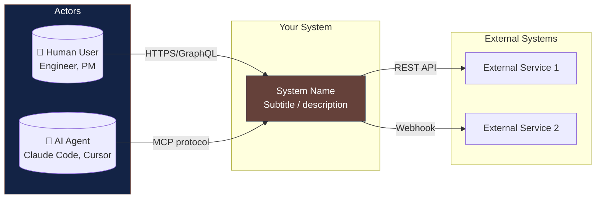
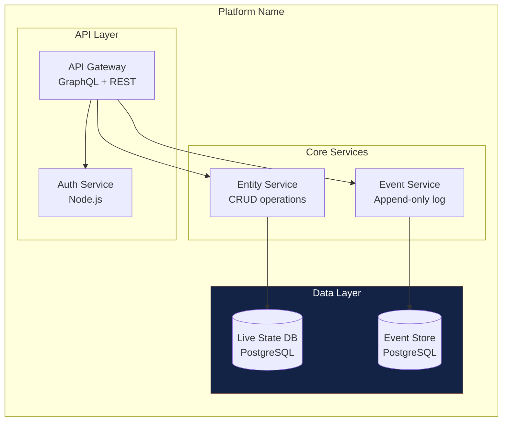
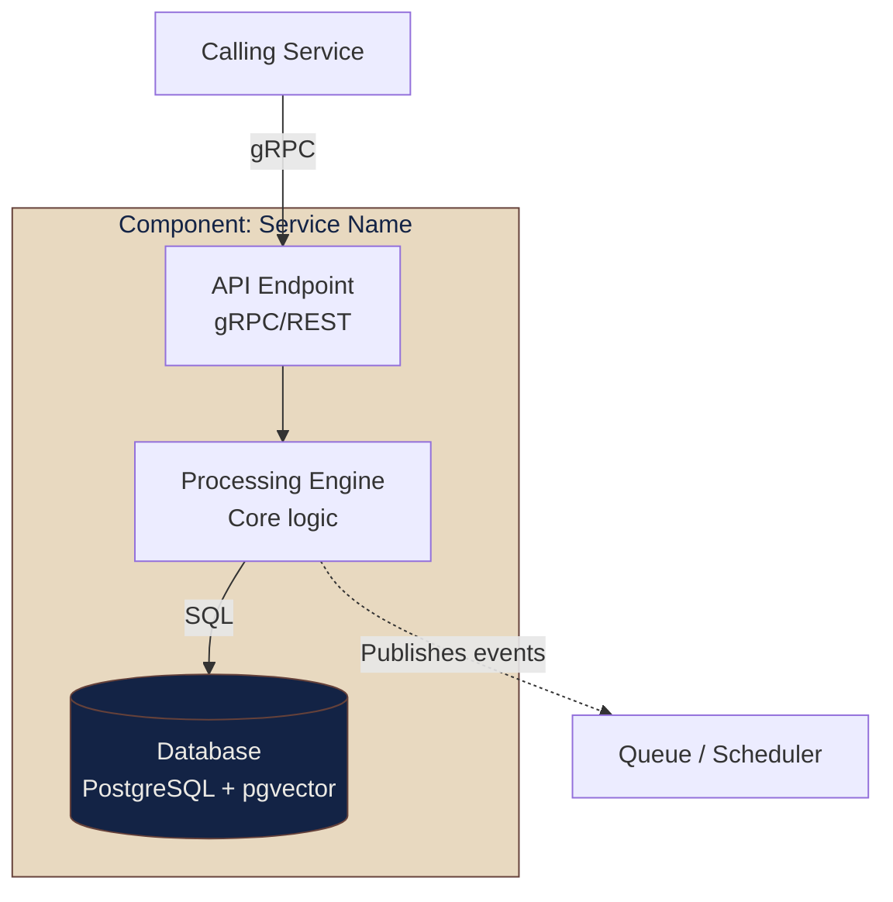

# 面向 GitHub 兼容 Mermaid 的 C4 → 流程图转换

GitHub 内置 Mermaid 渲染器**不**支持 C4 插件类型，例如 `C4Context`、`C4Container`、`C4Component`、`C4Deployment`、`C4Dynamic`。它们会渲染为原始代码块。应转换为标准 `flowchart` 语法，以在 GitHub、PR 预览和大多数 Markdown 渲染器中获得可用图表。

## 转换表

| C4 元素 | 流程图对应形式 | 示例 |
|-----------|---------------------|---------|
| `Person(label, "Name", "Desc")` | `LABEL["Name<br/>Desc"]` | `U["人类用户<br/>工程师、PM"]` |
| `System(label, "Name", "Desc")` | 带样式的 `LABEL["Name<br/>Desc"]` | `GP["GroktoPlan<br/>时间知识图谱"]`，增加 `style GP fill:#...` |
| `System_Ext(label, "Name", "Desc")` | 主子图外的 `LABEL["Name<br/>Desc"]` | 在 External 子图中的 `GIT["Git 提供商"]` |
| `Container(label, "Name", "Tech", "Desc")` | `LABEL["Name<br/>Tech Stack"]` | `KG["知识图谱<br/>Python + pgvector"]` |
| `ContainerDb(label, "Name", "Tech")` | `LABEL[("Name<br/>Tech")]`（圆柱括号） | `KGD[("知识图谱数据库<br/>pgvector")]` |
| `Db(label, "Name", "Tech")` | `LABEL[("Name<br/>Tech")]`（圆柱括号） | `LS[("实时状态数据库<br/>PostgreSQL")]` |
| `System_Boundary(name, "Title") { ... }` | `subgraph Title["Title"] ... end` | 嵌套子图 |
| `Container_Boundary(name, "Title") { ... }` | `subgraph Title["Title"] ... end` | 单个子图 |
| `Rel(from, to, "label", "tech")` | `FROM -- "label" --> TO` | `AR -- "gRPC" --> GA` |
| `Rel(from, to, "label")`（异步） | `FROM -.->|"label"| TO` | `EV -.->|"feeds"| KG` |
| `UpdateLayoutConfig($key="val")` | 省略，在 `flowchart LR`/`TB` 中设置方向 | `flowchart LR` 或 `flowchart TB` |

## 完整示例 1：系统上下文（C4Context → flowchart LR）



## 完整示例 2：容器图（C4Container → flowchart TB）



## 完整示例 3：组件图（C4Component → flowchart TB）



## 如何选择方法

| 上下文 | 方法 | 原因 |
|---------|----------|--------|
| GitHub README/PR/MD | 流程图转换 | 唯一可内联渲染的方法 |
| 正式 ADR / arc42 文档 | Structurizr DSL | 完整 C4 保真度、可导出 SVG |
| PDF 报告 | 预渲染 SVG（任一方法） | PDF 管线不执行 JS |
| 内部 Wiki（非 GitHub） | 取决于平台的 Mermaid 支持 | 先测试 C4 语法 |
| 架构产物金字塔 | 混合方式：L3 用 Structurizr，L1 内联用流程图 | 在需要深度处保留深度，在消费处提高可读性 |

## 常见陷阱

- **不要因为本地 Mermaid 编辑器可用，就假设 C4 在 GitHub 上可用。**GitHub 使用不带插件的旧版 Mermaid 构建。
- **`UpdateLayoutConfig` 没有流程图对应项。**通过方向头部，即 `flowchart LR` 与 `TB`，以及子图嵌套顺序控制布局。
- **子图不能跨流程图。**每个 C4 层级需要自己的 ````mermaid` 区块，不要把第 1 层与第 2 层放在同一张图中。
- **`flowchart LR` 中的嵌套子图可能导致宽图渲染问题。**具有多列的容器层图应使用 `flowchart TB`。
- **GitHub 在某些场景会移除内联样式。**在 Mermaid 中使用 GitHub 支持的 `style` 指令，而不要使用内联 CSS。
