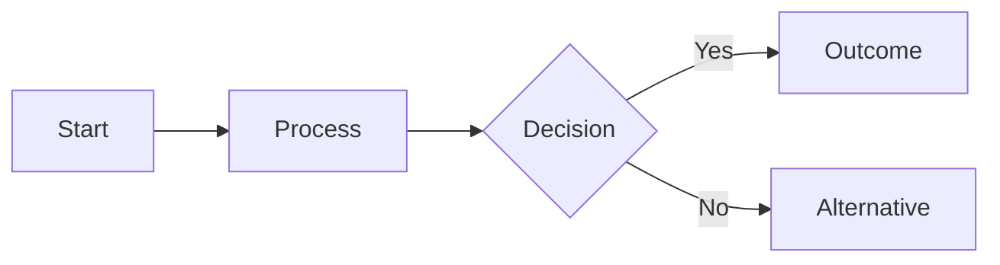
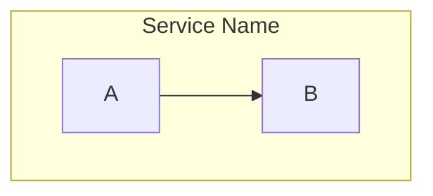
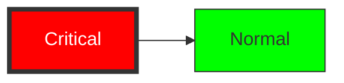

# Mermaid 流程图参考

## 基本语法

## 节点形状（v11.3+）

| 形状 | 语法 | 说明 |
|-------|--------|-------------|
| 矩形 | `A[text]` | 默认流程节点 |
| 圆角矩形 | `A(text)` | 开始/结束 |
| 体育场形 | `A([text])` | 终止节点 |
| 子程序 | `A[[text]]` | 预定义流程 |
| 圆柱 | `A[(text)]` | 数据库 |
| 圆形 | `A((text))` | 汇合点/连接器 |
| 非对称形 | `A>text]` | 输出 |
| 平行四边形 | `A[/text/]` | 输入/输出 |
| 梯形 | `A[/text\\]` | 输入（反向） |
| 六边形 | `A{{text}}` | 准备 |
| 菱形 | `A{text}` | 决策 |
| 双圆 | `A(((text)))` | 多重汇合 |

## 连线样式

| 语法 | 说明 |
|--------|-------------|
| `A-->B` | 箭头 |
| `A---B` | 线 |
| `A--text-->B` | 带标签箭头 |
| `A-.->B` | 虚线箭头 |
| `A==>B` | 粗箭头 |
| `A--oB` | 空心圆箭头 |
| `A--xB` | X 箭头 |

## 子图

## 样式

## C4 变通方式

基于流程图的 C4 近似模式见 `references/c4-mermaid.md`。
