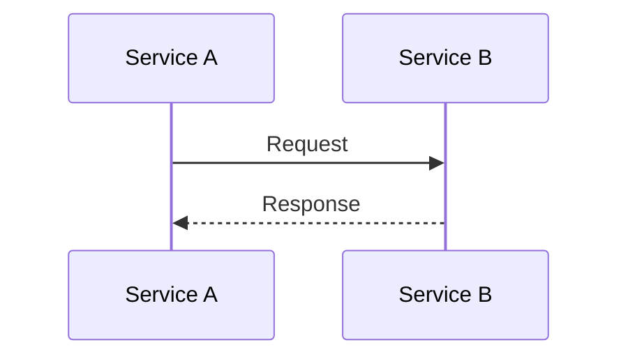
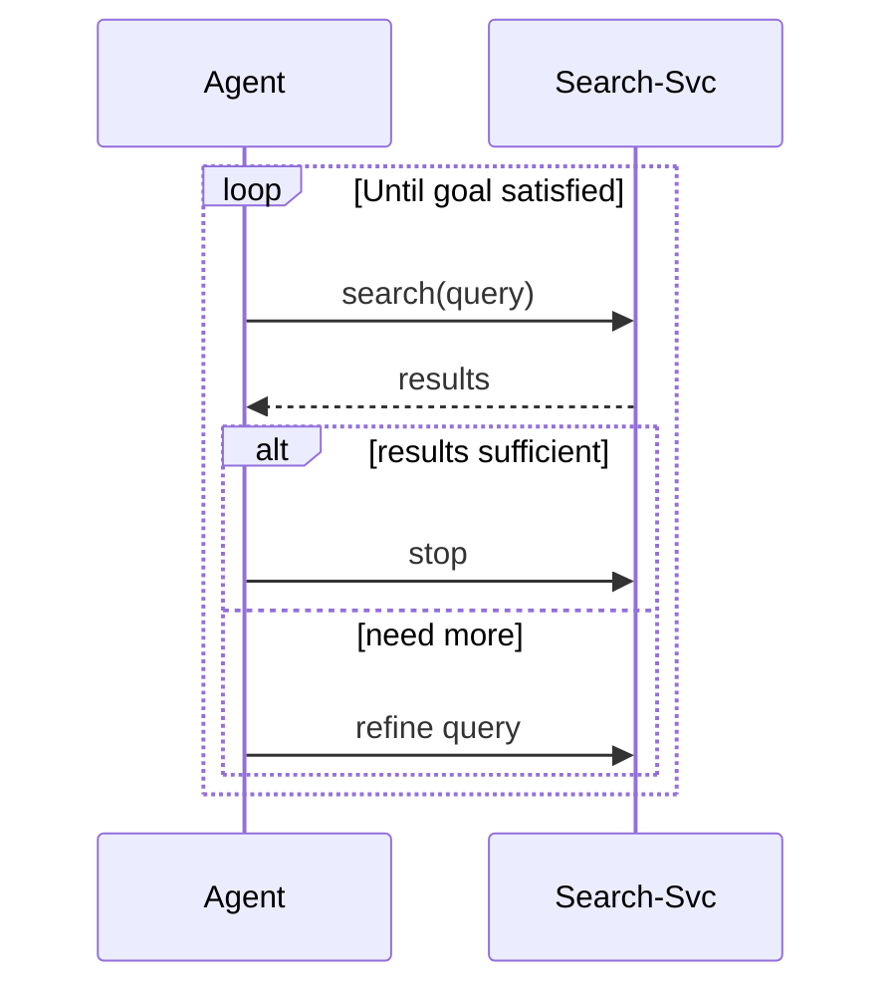
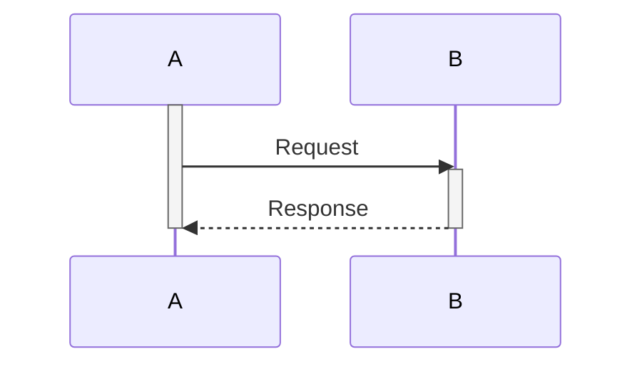

# 时序图

适合：交互协议、API 调用流、Agent 交接和多服务通信。

## 基本语法



## 参与者类型（v11+）

```mermaid
sequenceDiagram
  participant A as 🧑 User
  participant G as ⚙️ API Gateway
  participant B as 🕸️ Browser
  database D as 📦 Database
  actor E as 🌐 External

  A->>G: scrape(url)
  G->>B: render(url)
  B->>D: cache result
  B-->>A: markdown
```

## 循环和条件



## 激活（生命周期）



## 关键规则

- `activate`/`deactivate` 必须成对平衡。
- 条件分支使用 `alt`/`else`/`end`。
- 迭代使用 `loop`/`end`。
- 并行使用 `par`/`and`/`end`。
- 退出条件使用 `break`/`end`。
- 临界区使用 `critical`/`option`/`end`。
