# 逆向分析工作流：阶段 1–7 明细

*本文件是 `software-architecture-analysis` 技能的参考文件，加载方式：*
*`skill_view('software-architecture-analysis', file_path='references/reverse-engineering-workflow.md')`*

按阶段索引表确定当前阶段后，在此读取该阶段的完整步骤与命令。

---

## 阶段 1：克隆仓库并绘制结构

以浅克隆方式克隆目标仓库：

```bash
git clone --depth=1 https://github.com/owner/repo /tmp/target-repo
```

绘制顶层目录结构。针对每个目录识别：
- 使用的语言或框架。
- 属于前端、后端、服务、固件还是支持部分。
- 属于核心组件（业务逻辑）还是支持内容（CI、文档、工具）。

```bash
ls -la /tmp/target-repo/
find /tmp/target-repo -type f -name "*.swift" | sort   # 也可以是 *.py、*.rs、*.ts、*.go
```

## 阶段 2：识别关键架构文件

按行数排序以找到最大的文件，这些文件通常承载核心逻辑：

```bash
wc -l /tmp/target-repo/**/*.swift /tmp/target-repo/**/**/*.swift 2>/dev/null | sort -n
```

阅读排名靠前的 15 至 25 个文件，优先级如下：
1. **入口点：**`main`、`App`、`bootstrap`，了解应用如何启动。
2. **数据模型：**在系统中流转的类型。
3. **核心服务：**采集、处理和存储管线。
4. **UI 或页面文件：**从用户视角识别功能范围。
5. **配置：**环境文件、配置结构，识别外部依赖。
6. **隐私敏感文件：**任何访问用户数据的服务。

## 阶段 3：绘制架构

针对每个核心服务识别：

- **采集内容：**数据类型、来源、频率和存储位置。
- **处理位置：**本地还是云端，以及调用哪些 API 或服务。
- **存储位置：**本地数据库、云数据库或文件系统。
- **外部依赖：**所有第三方服务、API 密钥和云提供商。
- **隐私状况：**哪些数据会在什么条件下离开本机。

使用 Mermaid 语法绘图，GitHub 和大多数 Markdown 编辑器均可原生渲染：

```mermaid
graph TD
    subgraph Capture["采集层"]
        CAM[摄像头/麦克风采集]
        FS[文件扫描器]
    end

    subgraph Processing["处理层"]
        OCR[OCR/NLP]
        STT[语音转文本]
    end

    subgraph Storage["存储层"]
        DB[(本地数据库)]
        CLOUD[(云同步)]
    end

    CAM --> OCR
    FS --> OCR
    STT --> DB
    OCR --> DB
    DB --> CLOUD

    style Capture fill:#0a1a2e,stroke:#22d3ee
    style Processing fill:#0a2a1a,stroke:#34d399
    style Storage fill:#1a0a3a,stroke:#a78bfa
```



使用子图表示云端与本地边界。所有图表代码块都必须使用 ` ```mermaid `，不得使用 ASCII 方框图或图像文件。

## 阶段 3b：接口提取模式（DAO/提供者契约设计）

当目标是提取**隐式契约**，即代码库需要数据库或存储层提供哪些操作时，遵循以下变体流程：

### 步骤 1：先阅读设计理念

接触代码前，先阅读所有 `PHILOSOPHY.md`、`DESIGN.md`、`ARCHITECTURE.md` 或主 `README`。这些文件包含接口必须遵守的设计约束。例如，cashew 思维图库的 `PHILOSOPHY.md` 提出“简单图、智能推理层”：边不携带类型标签，节点类型只是提供给 LLM 的描述性提示，不承担图引擎操作的核心语义。这项约束必须融入契约。

### 步骤 2：编目所有存储操作

阅读所有接触存储层（数据库、文件系统、外部服务）的文件，列出每个文件中的不同操作：

| 类别 | 示例操作 |
|----------|-------------------|
| 节点 CRUD | create、read、update、delete、scan、count |
| 边 CRUD | create_edge、get_neighbors、delete_incident |
| 向量 KNN | find_similar、set_embedding、delete_embedding |
| 图遍历 | bfs、shortest_path、trace_derivation |
| 维护 | similarity_candidates、random_sample、get_metrics |
| 事务 | begin、commit、rollback |

根据命名约定定位文件：`db.py`、`store.py`、`storage.py`、`embedding.py`、`session.py`、`persist.py`，以及所有批处理或维护模块。

### 步骤 3：识别表明边界泄漏的变通实现

寻找因*底层实现限制*而存在、并非源于应用逻辑的代码。相关信号包括：

- 双写模式，为不同查询路径把相同数据写入两张表。
- 维度不匹配检测和回退链。
- 为执行底层实现本应原生支持的操作，把整张表加载到 numpy/scipy。
- 使用递归 CTE 在 SQL 中重新实现图遍历。
- 通过 `try/except` 在快速路径和回退路径之间切换。
- 类似“因为 X 不原生支持 Y，所以需要这样做”的注释。

这些变通实现是**当前边界位置错误所产生的成本**，应考虑将它们移到契约之后。

### 步骤 4：根据操作清单设计契约

定义抽象接口（ABC、Protocol 或 trait），涵盖步骤 2 中的每项操作，同时不泄漏步骤 3 中的底层实现细节。

**设计原则：**
- 面向代码库的*需求*设计，而不是面向当前底层实现的*现有能力*设计。
- 让设计理念约束接口。
- 相似度搜索、图遍历和扫描等高成本操作决定性能特征，契约必须允许原生底层实现高效完成这些操作。
- 事务必须显式表达。

### 步骤 5：通过双提供者证明进行验证

设计第二种提供者实现来检验抽象。它不必达到生产可用水平，只需通过同一套测试。双提供者证明可以发现：

- 过度依赖原始底层实现语义的操作。
- 第二种提供者需要但契约缺失的操作。
- 契约泄漏，例如方法签名假设了类似 SQL 的游标行为，而不是返回数据类。

完整示例见 [references/interface-extraction-pattern.md](references/interface-extraction-pattern.md)，其中使用真实开源项目 cashew 思维图库演示全部五个步骤。

## 阶段 4：功能范围清单

通过阅读 UI 视图文件、页面文件和引导界面，绘制所有面向用户的功能，并按以下类别分组：

- **采集：**录制、扫描、导入。
- **处理：**转录、OCR、分析。
- **AI：**聊天、助手、洞察、建议。
- **存储：**本地、云端、导出。
- **集成：**第三方服务、API。
- **插件：**扩展、自定义工具、MCP。

## 阶段 5：编写洁净室规范

**这是最关键的阶段。**输出文档必须：

1. **描述架构模式**，但不引用或复现源代码。
2. **使用自然语言**描述组件如何交互。
3. **按架构层级引用原始代码库**，不使用行号或变量名。
4. **绝不包含源代码片段**，不得包含参考实现中的 Swift、Rust、Python 或其他代码。规范面向*新代码*，而不是衍生作品。

**“无污染”原则：**如果输出包含可以辨认出来自参考实现的代码模式，应在更高抽象层级上重写。

输出采用以下章节结构：
- 产品愿景与设计原则。
- 架构概览（Mermaid 图）。
- 功能需求（编号）。
- 非功能需求（性能、电池、隐私）。
- 技术架构（包含技术选型的组件清单）。
- 插件或扩展 API 规范。
- 隐私架构细节（数据流图）。
- 发布标准（MVP → v1 → v2）。

**图表规则：**
- 所有图表均使用 ` ```mermaid ` 代码块，不使用 ASCII 方框图或图像文件。
- 每条管线使用独立的 Mermaid 代码块绘制数据流图，不要合并成一张单体图。
- 每个外部依赖都要注明其开放标准替代方案，例如“兼容 OpenAI 的 API，因此可使用任意提供商”。

## 阶段 6：改变约束重新设计

在新的设计约束（本地优先、隐私优先）下重新构想系统时：

1. 识别参考架构中的每个强制云依赖。
2. 为每个依赖确定本地替代方案，例如云 API → 本地模型、Firestore → SQLite。
3. 对同时支持本地和云端的接口，指定开放标准，例如兼容 OpenAI 的 API、兼容 S3 的存储、兼容 Whisper 的语音转文本。
4. 如果参考实现采用侵犯隐私的模式，例如访问浏览器 Cookie 或直接读取其他应用的 SQLite 数据，应将其标为**禁止机制**；新设计必须使用适当的 API，例如 OAuth、平台 API 或官方 SDK。

## 阶段 7：交付后 QA

交付设计文档后：

1. **验证链接完整性：**如果文档引用其他设计文档，确保存在双向链接。运行 Markdown 链接检查器以发现断裂引用。
2. **验证图表渲染：**确认所有 ` ```mermaid ` 代码块均可渲染，并检查输出中不存在 ASCII 方框字符（`┌`、`├`、`└`、`┐`、`┤`、`┘`、`┴`、`┬`、`┼`）。
3. **检查代码污染：**扫描所有看似来自参考实现的内联源代码片段，发现后在架构层级重写。
4. **审计交叉引用：**一个章节引入的每个概念都应与另一章节中的实现建立关联，文档必须保持内部一致。
